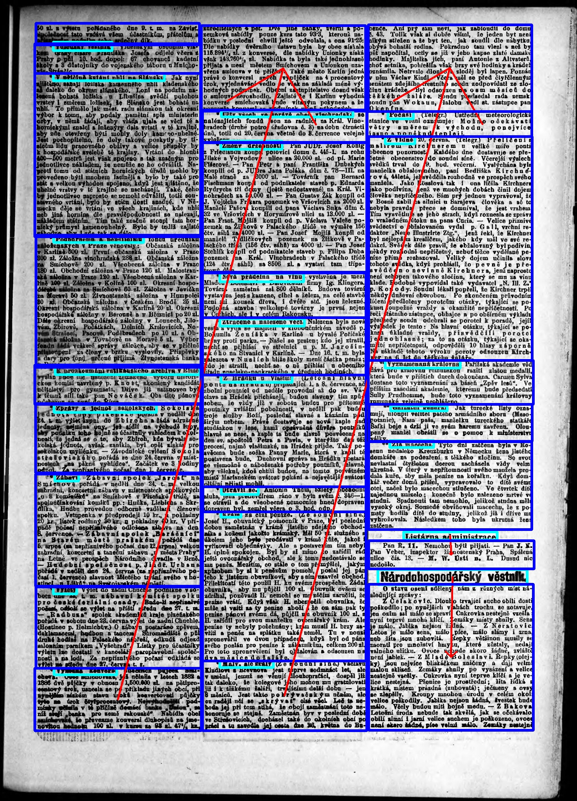
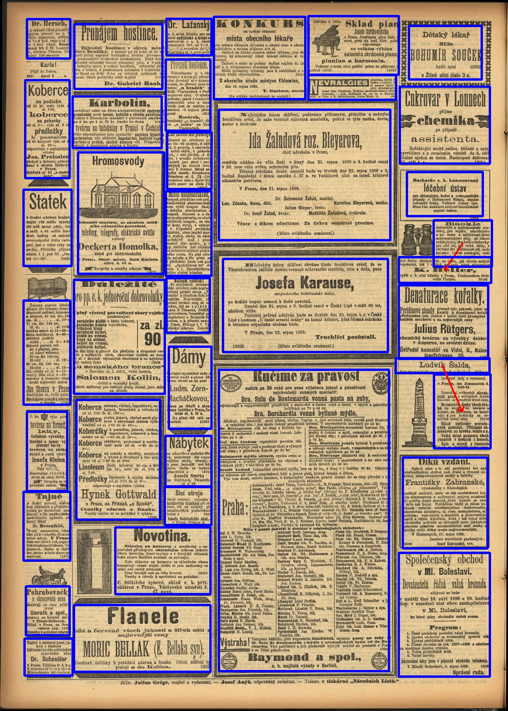
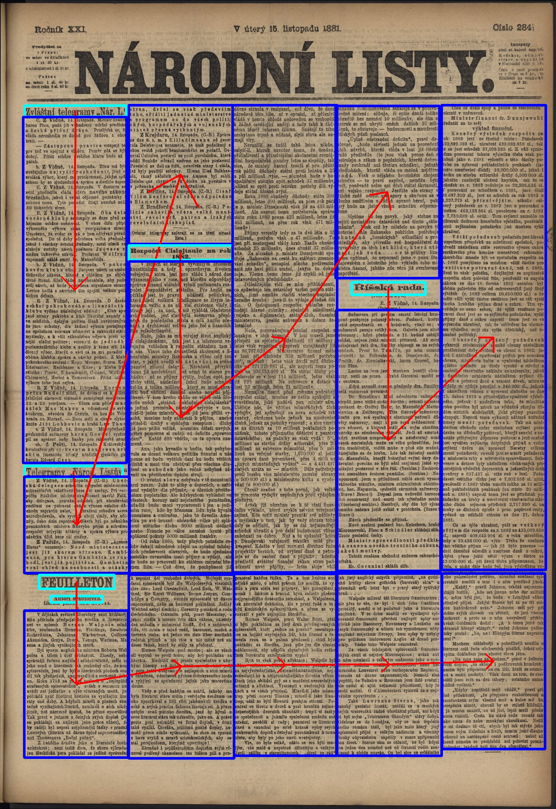

# TextBite

TextBite is a human-annotated historical Czech document dataset for logical document segmentation and document layout analysis containing `8449` pages from Czech libraries.

## Example pages with annotations

<p align="center">
  
  
  
</p>

## News

|   |    |
|----------|-----------------------------------|
| **Mar. 14th, 2025**      | The TextBite dataset has been published. |


## Overview

The TextBite dataset consists of scanned historical Czech documents from various sources with diverse layouts. It includes simpler layouts, such as book pages and dictionaries, as well as more complex multi-column formats from newspapers, periodicals, and other printed materials. Additionally, part of the dataset contains handwritten documents, primarily records from schools and public organizations, introducing extra segmentation challenges due to their more loosely structured layouts.

In total, the dataset contains 8,449 annotated pages, from which 7,346 pages are printed and 1,103 are handwritten. The pages contain a total of 78,863 segments. The test subset contains 964 pages, of which 185 are handwritten. The annotations are provided in an extended COCO format. Each segment is represented by a set of axis aligned bounding boxes, which are connected by directed relationships, representing reading order. To include these relationships in the *COCO* format, a new top-level key *relations* is added. Each relation entry specifies a source and a target bounding box.

In addition to the layout annotations, we provide a textual representation of the pages produced by Optical Character Recognition (OCR) tool *PERO-OCR*. These come in the form of XML files in the *PAGE-XML* format, which includes an enclosing polygon for each individual textline along with the transcriptions and their confidences. Lastly, we provide the OCR results in the *ALTO* format, which includes polygons for individual words in the page image.

## Download

The dataset is publicly available at [Zenodo](https://zenodo.org/records/15057331)

| Dataset | Size  | URL  |
|--------------|----------|-------------|
| TextBite Dataset | 11.7G | [Download](https://zenodo.org/records/15057331/files/textbite-dataset.zip?download=1)|
| Test Labels | 218M | [Download](https://zenodo.org/records/15057331/files/textbite-test-labels.zip?download=1)|
| Baseline Models | 448B | [Download](https://zenodo.org/records/15057331/files/models.zip?download=1) |


## Dataset structure

TextBite provides four types of data assets:

1. JPG images of all pages in their original resolution
2. Bounding-box and relation annotations in *COCO* format for each JPG image
3. OCR transcriptions with textline polygons in the *PAGEXML* format
4. OCR transcriptions with word polygons in the *ALTO* format

The dataset is organized in the following directory structure:
```
├── coco
│   ├── test.json
│   ├── dev.json
├── images
│   ├── sample1.jpg
│   ├── ...
├── pagexml
│   ├── sample1.xml
│   ├── ...
├── alto
│   ├── sample1.xml
│   ├── ...
```

## Evaluation

We propose evaluating logical page segmentation as a clustering problem, focusing on pixel-level segmentation instead of traditional text-based methods. Our approach excludes background pixels, considering only letter pixels, making evaluation OCR-independent and robust across segmentation techniques. Segmentation quality is measured using the Rand Index, comparing clustered text regions while ignoring background noise.

Evaluation can be performed using the `/evaluation/eval_labeling.py` script with the following parameters:
- `--ref-dir`: Directory containing ground truth labels in *.npy* format.
- `--hyp-dir`: Directory with predictions in *.json* format. Each prediction file should contain a list of segments, where each segment is represented as a list of polygons. Example *.json* files can be seen in `/data/json`.

## Paper

**TextBite: A Historical Czech Document Dataset for Logical Page Segmentation**

- Martin Kostelník (ikostelnik@fit.vut.cz)
- Karel Beneš (ibenes@fit.vut.cz)
- Michal Hradiš (ihradis@fit.vut.cz)

ArXiv link: [Arxiv](https://arxiv.org/abs/2503.16664)

**Citation:**

```
@article{kostelnik2025textbite,
  title={TextBite: A Historical Czech Document Dataset for Logical Page Segmentation},
  author={Kosteln{\'\i}k, Martin and Bene{\v{s}}, Karel and Hradi{\v{s}}, Michal},
  journal={arXiv preprint arXiv:2503.16664},
  year={2025}
}
```
